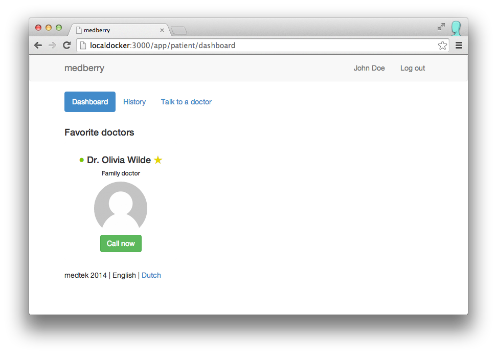
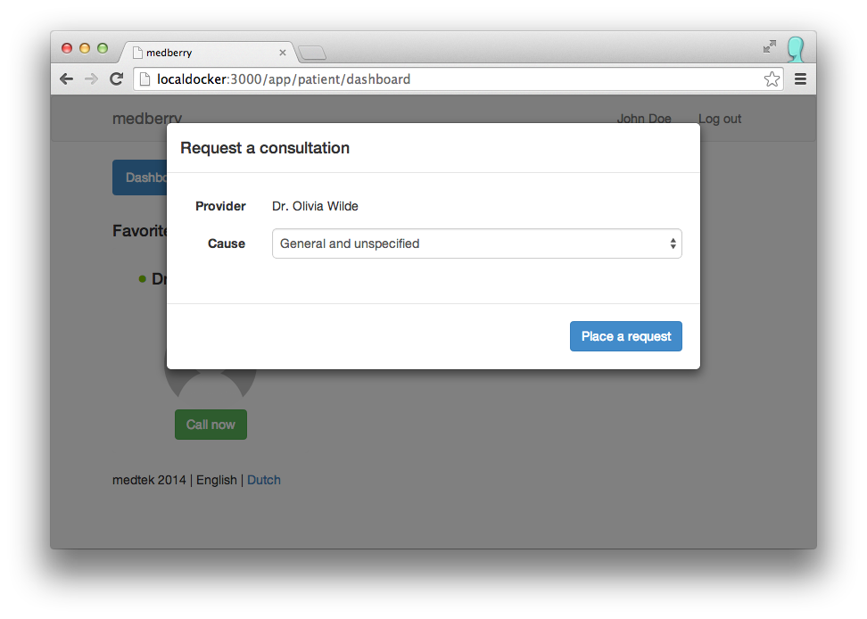
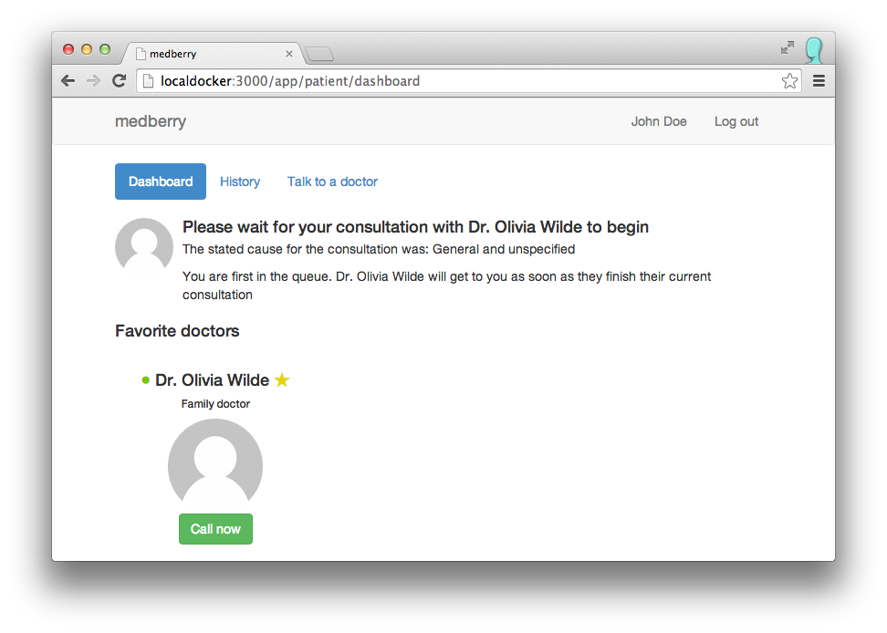
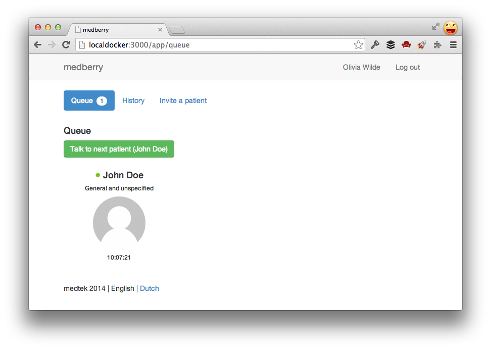
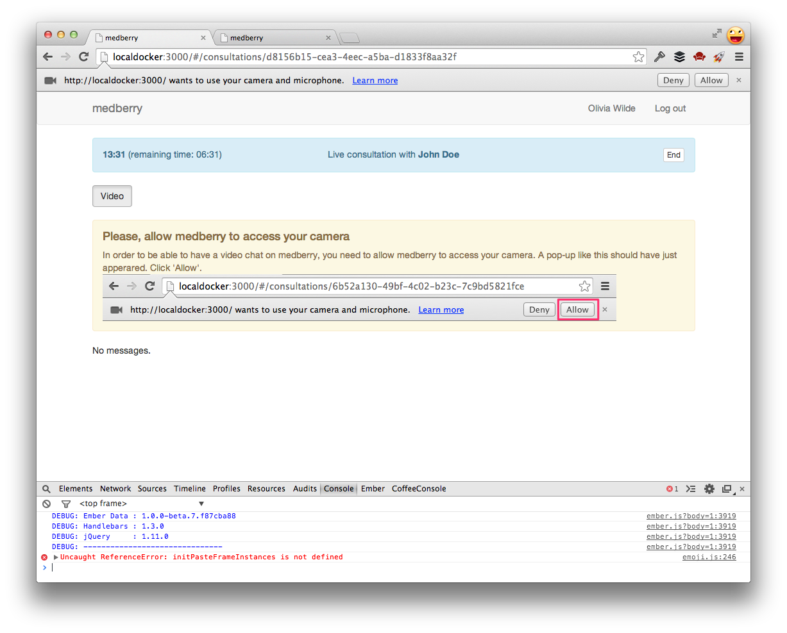
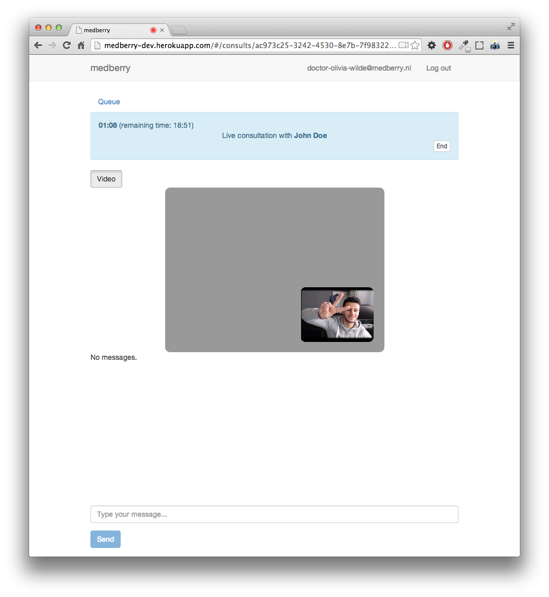

# medberry

medberry is a platform to connect patients with doctors via live video
chat.

## Development environment

### Getting started

1. Install [Docker](http://www.docker.io) (use
   [docker-osx](https://github.com/noplay/docker-osx) on OS X)
2. Install [Fig](http://orchardup.github.io/fig/)
3. Clone this repo and cd into project directory

### Starting the app

Once docker and fig are installed, before you can start the application and all
needed services using the following commands:

    fig up -d redis db # start up the database & redis
    fig run web rake db:setup # migrate db & seed
    fig up web # run the web server
    fig run web sidekiq # run the background job processor

This will build docker containers and expose the Rails application at
http://localdocker:3000/ (if you are using docker-osx).

## Configuration

To function properly, the application needs to connect to Tokbox,
Pusher, etc. These are the environment variables that need to be present
at runtime:

* `OPEN_TOK_KEY`
* `OPEN_TOK_SECRET`
* `PUSHER_URL`
* `MIXPANEL_TOKEN`

## License

All rights reserved.
